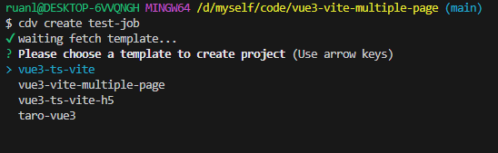

## 前言

本项目是一个 vue3+vite+ts 的多页面（MPA）模板，支持单独模块打包，支持本地开发只编译单独模块，同时，也支持多模块一起打包和本地编译。

## 脚手架安装

本项目支持通过`cdv-cli`脚手架来安装，脚手架目前提供 vue3 单页开发模板，vue3 多页开发模板，vue3 移动端 H5 开发模板。

[cdv-cli 脚手架使用方法点击查看](https://github.com/ruanlin-kylin/cdv-cli)



## 技术栈

- [vite](https://cn.vitejs.dev/) 尤大团队开发的新一代构建工具，急速启动，快速热载
- [axios](https://www.kancloud.cn/yunye/axios/234845) 这个就不用介绍了吧，使用最广泛的 ajax 封装插件
- [naive-ui](https://www.naiveui.com/zh-CN/dark/docs/introduction) 尤雨溪推荐 UI 库，TypeScript 语法，主题可调，为 vue3 而生
- [vueuse](https://vueuse.org/) 尤雨溪推荐，可以理解为 vue3 的 hooks 库，专为 vues 设计
- [pinia](https://pinia.vuejs.org/) 尤雨溪推荐，替代 vuex4，作者原话 pinia 就是 vuex5 了

## 项目说明

- 执行指令 yarn dev，通过`http://localhost:5238/`访问到最外层的 index.html 文件，然后通过该页面可以进入到 main 模块 和 minor 模块。

  - vite.config.ts 中有个`root`属性，用来配置项目访问入口的根路径，默认应该是'./'，即 vite.config.ts 文件所在的路径。
  - 使用默认的`root`，执行指令 yarn dev，直接访问`http://localhost:5238`,然后进入相应的模块，你可能感觉路由有点怪异。这可以通过更改`root`的值和路由的`basePath`来修正。以下是默认配置。

  ```javascript
    /** 以下是默认的 三个 文件 配置。*/
   // vite.config.ts
   export default defineConfig({
        root: env.VITE_APP_ROOTPATH,   // VITE_APP_ROOTPATH  在.env 文件中设置
   })

   // .env
    VITE_APP_ROOTPATH = ./

   // main模块 router/index.ts
   const router = createRouter({
        history: createWebHistory()
    });

  ```

  你可以按下面这样修改，修改完成后，直接访问`http://localhost:5238/`会报错`not find page`，需要拼接 URL 通过`http://localhost:5238/main/`、`http://localhost:5238/minor/`来分别访问 main 和 minor

  ```javascript
  /** 以下是修改后 三个 文件 配置。*/
  // vite.config.ts
  export default defineConfig({
      root: env.VITE_APP_ROOTPATH,   // VITE_APP_ROOTPATH  在.env 文件中设置
  })

  // .env
  VITE_APP_ROOTPATH = ./src/modules/

  //main模块 router/index.ts
  const router = createRouter({
      history: createWebHistory('main')
  });

  ```

  因为本项目模板的 minor 模块没有配置 router，所以没有举例。如果要配 minor 模块的 router，思路按以上说明即可。

- 执行指令 yarn build，打包出来文件同时包含 main 和 minor 模块，也需要通过在域名后分别加上`main`和`minor`上下文根，才能分别访问到`main`和`minor`模块。如果部署在同个服务器 nginx，也可以分别通过 main 和 minor 去代理。

## 开发运行

```bash
    # 安装依赖
    yarn install

    # 本地开发 开启所有模块服务
    yarn dev

    # 本地开发 开启单个模块
    yarn main
    yarn minor

    # 所有模块一起打包
    yarn build

    # 单独模块打包
    yarn build:main
    yarn build:minor


```

## 目录结构

```
├── public (存放公共文件)
│ └── favicon.ico
├── src
│ ├── assets (公共资源)
│ │ ├── logo.png
│ │ └── ...
│ ├── components (业务组件)
│ │ └── ...
│ ├── modules (业务模块)
│ │ ├── main (业务模块 1)
│ │ │ ├── router
│ │ │ ├── store
│ │ │ ├── view
│ │ │ ├── App.vue
│ │ │ ├── index.html
│ │ │ └── main.ts
│ │ ├── minor (业务模块 2)
│ │ │ ├── App.vue
│ │ │ ├── index.html
│ │ │ └── main.ts
│ ├── service (公共服务)
│ │ ├── api
│ └─└── http.ts
├── index.html
├── package.json
├── README.md
├── tsconfig.ts
└── vite.config.ts
```

## 本项目 git Commit message 统一规范

使用[Angular 团队提交规范](https://github.com/angular/angular.js/blob/master/DEVELOPERS.md#-git-commit-guidelines)

常用的修改项

- feat: 增加新功能
- fix: 修复问题/BUG
- style: 代码风格相关无影响运行结果的
- perf: 优化/性能提升
- refactor: 重构
- revert: 撤销修改
- test: 测试相关
- docs: 文档/注释
- chore: 依赖更新/脚手架配置修改等
- ci: 持续集成

## 结尾

本项目可以免费使用，如果本项目对您有帮助的话，麻烦给个 star 鼓励下~

**[⬆ 返回顶部](#前言)**
